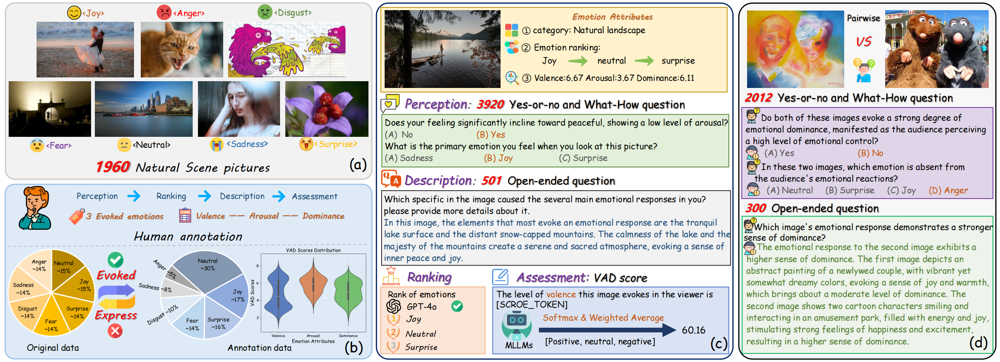
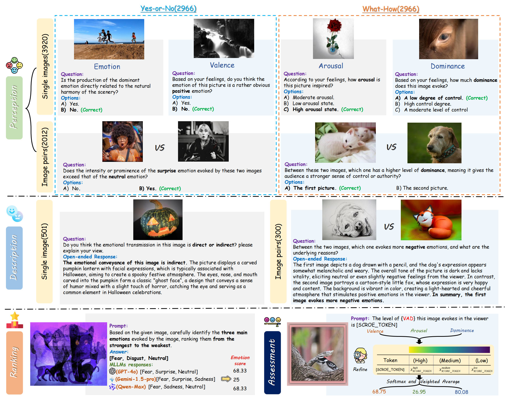
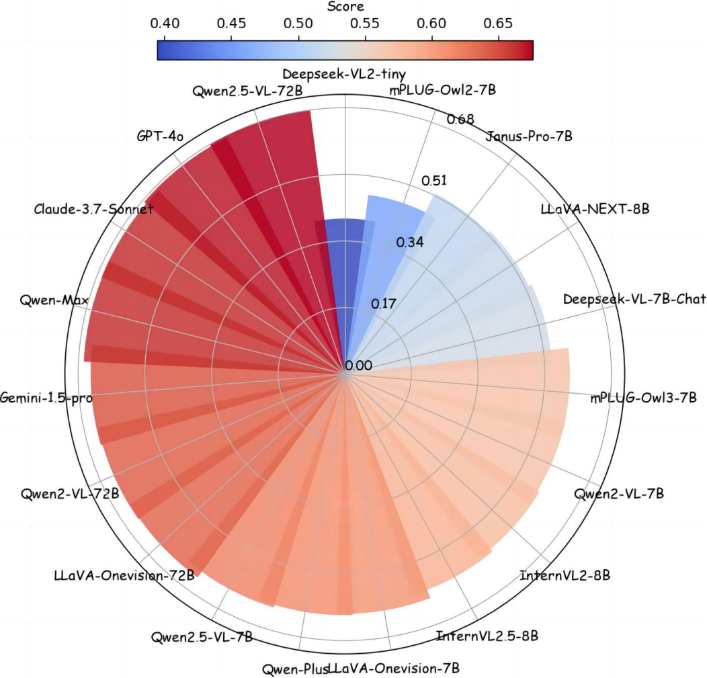
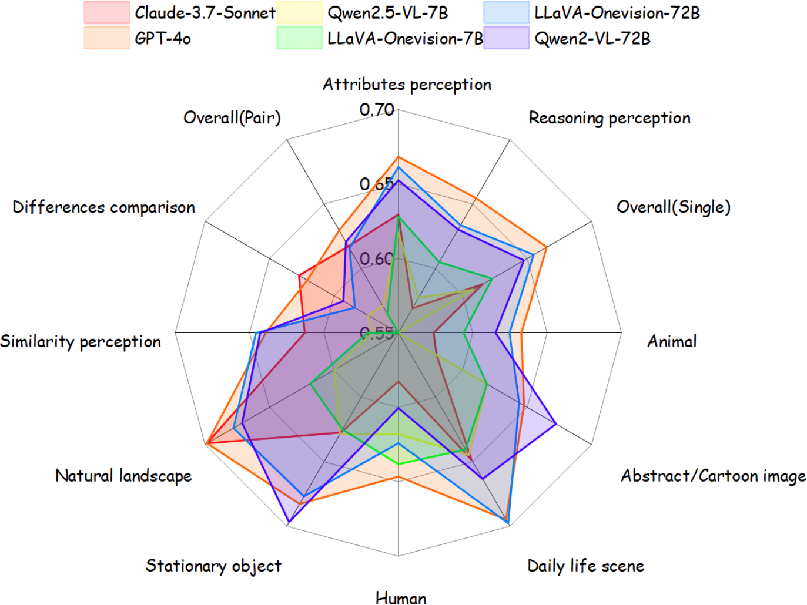

 

    
    
    

<h1>EEmo-Bench: A Benchmark for Multi-modal Large Language Models on Image Evoked Emotion Assessment</h1>

_How MLLMs Perform on Image Evoked Emotion Understanding?_

    <a href="https://scholar.google.com.hk/citations?hl=zh-CN&user=6KCeFTQAAAAJ&view_op=list_works&gmla=AH8HC4zpp4nUK5A3YmkhcwdHF2O5NwoCsCInYb0SW2ZHWxl-tUMaE_8OISiYvwIAfFSyg033cF7FLxHchO-sedO9qI_fHD0QlzjsiUCAvSc" target="_blank">Lancheng Gao</a>1,
    <a href="https://scholar.google.com/citations?user=JYqad5sAAAAJ&hl=zh-CN" target="_blank">Ziheng Jia</a>1,
    <a href="https://orcid.org/0009-0001-6429-5763" target="_blank">Yunhao Zeng</a>1,
    <a href="https://scholar.google.com/citations?hl=zh-CN&user=nDlEBJ8AAAAJ" target="_blank">Wei Sun</a>1,

    <a href="https://github.com/mingZhang614" target="_blank">Yiming Zhang</a>1,
    <a href="https://scholar.google.com/citations?hl=en&user=vbR9_cgAAAAJ&view_op=list_works&sortby=pubdate" target="_blank">Wei Zhou</a>2,
    <a href="https://ee.sjtu.edu.cn/en/FacultyDetail.aspx?id=24&infoid=153&flag=153" target="_blank">Guangtao Zhai</a>1,
    <a href="https://minxiongkuo.github.io/" target="_blank">Xiongkuo Min</a>1#

  

        1Shanghai Jiaotong University,  2Cardiff University
    
   

    # Corresponding author. 

    <a href="https://arxiv.org/abs/2504.16405"><strong>Paper</strong></a> |
    <a href="https://github.com/workerred/EEmo-Bench"><strong>Github</strong></a> |
    <a href="https://huggingface.co/datasets/Workerred/EEmo-Bench_single"><strong>Single Image Data</strong></a>   |
    <a href="ttps://huggingface.co/datasets/Workerred/EEmo-Bench_pair"><strong>Image Pair Data</strong></a>  

      

we introduce **EEmo-Bench**, a novel benchmark dedicated to the analysis of the <u>e</u>voked <u>emo</u>tions in images across diverse content categories. Our core contributions include:
  1. Regarding the diversity of the evoked emotions, we adopt an emotion ranking strategy and employ the Valence-Arousal-Dominance (VAD) as emotional attributes for emotional assessment. In line with this methodology, 1,960 images are collected and manually annotated.
  2. We design four tasks to evaluate MLLMs' ability to capture the evoked emotions by single images and their associated attributes: **Perception**, **Ranking**, **Description**, and **Assessment**. Additionally, image-pairwise analysis is introduced to investigate the model's proficiency in performing joint and comparative analysis.
  
  In total, we collect 6,773 question-answer pairs and perform a thorough assessment on 19 commonly-used MLLMs.
  The results indicate that while some proprietary and large-scale open-source MLLMs achieve promising overall performance, the analytical capabilities in certain evaluation dimensions remain suboptimal.
  Our **EEmo-Bench** paves the path for further research aimed at enhancing the comprehensive perceiving and understanding capabilities of MLLMs concerning image-evoked emotions, which is crucial for machine-centric emotion perception and understanding.

## Release
- [2025/7/7] 🔥 Release official Results of 19 commonly-used MLLMs on EEmo-Bench, click on [leaderboards](https://github.com/workerred/EEmo-Bench/tree/main/leaderboards) to view details
- [2025/7/6] 🔥 Release the sample script for testing on EEmo-Bench.
- [2025/7/5] 🔥 Release [single-image](https://huggingface.co/datasets/Workerred/EEmo-Bench_single) and [image-pair](https://huggingface.co/datasets/Workerred/EEmo-Bench_pair) evoked emotion understanding question-answer datasets.
- [2025/7/4] 🔥 Our work ["EEmo-Bench: A Benchmark for Multi-modal Large Language Models on Image Evoked Emotion Assessment"](https://arxiv.org/abs/2504.16405) is accepted by ACMMM 2025.

## EEmo-Bench Construction
For each image in EEmo-Bench, a content category and two types of emotional attributes are attached: 

1. **Content category.**
    - **Six category**: Animal, Human, Stationary object, Daily life scene, Natural landscape, and Abstract/Cartoon image.
2. **Evoked emotions ranked by intensity.** 
   - **7 basic emotions**: Joy, Anger, Disgust, Sadness, Surprise, Fear, and Neutral.
   - We rank the **top three** evoked emotions from strongest to weakest (*e.g.*, [Joy, Neutral, Surprise])
3. **VAD scores** (Self-Assessment Manikin 9-point scale).
    - **Valence**, which reflects the overall positive or negative emotion elicited by images, indicating the emotional tone of the viewer’s response.
    - **Arousal**, which represents the intensity of theevoked emotion, rating from intense to calm.
    - **Dominance**, which measures the degree of influence over emotions and determines how emotions are experienced in terms of one’s sense of agency and authority in a particular emotional context, ranging from powerful to helpless.

Based on the constructed dataset and emotional attributes, we propose **EEmo-Bench** to omprehensively evaluate the evoked emotion understanding abilities of multiple MLLMs from four tasks, including **Perception**, **Ranking**, **Description**, and **Assessment**. The brief introduction subcategories are organized as follows:

1. **Perception.** The perception task concentrates on evaluating the evoked emotion perception abilities of MLLMs, focusing on their accuracy in question answering related to emotion category and emotional attributes.
   - **Question types**: Yes-or-No questions, What/How questions.
   - **Carrier**: Single-image, Image-pair.
   - **Perceptual_dimension**: Emotion perception, Valence perception, Arousal perception, Dominance perception.
   - **Question_concern**: Attributes perception, Reasoning perception, Similarity perception, Differences comparison.

2. **Ranking.** During each MLLM evaluation, the seven candidate emotions are provided as options, and we instruct the MLLMs to choose and rank no more than three predominant evoked emotions according to their intensity.

3. **Description.** We also assess the descriptive abilities of MLLMs.
   - **Carrier**: Single-image, Image-pair. 
   - **Describing dimension**: Detailed description, Reasoning description, Direct-Indirect, Conflicts description, Detailed comparison, Valence comparison, Arousal comparison, Dominance comparison, and other.

4. **Assessment.** In the final task, we benchmark the ability of MLLMs to quantify the VAD scores. 
   

      
  

## Glance at Q-Bench-Video Performance

  
  

  
  

**A overview of the EEmo-Bench Results.**

Outcomes on Perception, Ranking, and Description task.

| Task                           | Perception   |           |          |            |           |          |                       |          |          |            |         | Ranking | Descrption           |                       |                 |                       |         |                     |                    |                    |                      |         |         |
|--------------------------------|--------------|-----------|----------|------------|-----------|----------|-----------------------|----------|----------|------------|---------|---------|----------------------|-----------------------|-----------------|-----------------------|---------|---------------------|--------------------|--------------------|----------------------|---------|---------|
| Sub-categories                 | Single Image |           |          | Image Pair |           |          | Perceptual Dimensions |          |          |            | overall |         | Single               |                       |                 |                       |         | Pair                |                    |                    |                      |         | Overall |
| Model                          | Yes-or-No↑   | What/How↑ | Overall↑ | Yes-or-No↑ | What/How↑ | Overall↑ | Emotion↑              | Valence↑ | Arousal↑ | Dominance↑ |         |         | Detailed description | Reasoning description | Direct-Indirect | Conflicts description | Overall | Detailed comparison | Valence comparison | Arousal comparison | Dominance comparison | Overall |         |
| Random guess w/o open-ended    | 50.00%       | 33.33%    | 41.67%   | 50%        | 34.26%    | 42.13%   | 39.38%                | 44.62%   | 44.72%   | 44.44%     | 41.83%  | 25.48%  |                      |                       |                 |                       |         |                     |                    |                    |                      |         |         |
| Medium-scale open-source MLLMs |              |           |          |            |           |          |                       |          |          |            |         |         |                      |                       |                 |                       |         |                     |                    |                    |                      |         |         |
| Deepseek-vl2-tiny              | 54.62%       | 46.99%    | 50.81%   | 50.40%     | 38.41%    | 44.41%   | 45.47%                | 53.97%   | 53.99%   | 48.13%     | 48.63%  | 21.82%  | 50.07%               | 54.76%                | 53.91%          | 44.30%                | 50.82%  | 32.91%              | 56.93%             | 44.67%             | 36.48%               | 43.13%  | 47.94%  |
| Deepseek-vl-chat-7B            | 60.18%       | 50.14%    | 55.16%   | 52.88%     | 38.71%    | 45.80%   | 51.30%                | 59.41%   | 56.36%   | 43.93%     | 51.98%  | 57.12%  | 45.47%               | 53.66%                | 55.11%          | 44.82%                | 49.46%  | 39.75%              | 58.13%             | 48.67%             | 33.33%               | 46.73%  | 48.44%  |
| InternVL2-8B                   | 58.04%       | 53.62%    | 55.83%   | 57.06%     | 49.45%    | 53.26%   | 55.16%                | 62.55%   | 54.09%   | 47.11%     | 54.96%  | 57.07%  | 56.07%               | 65.79%                | 64.67%          | 53.95%                | 59.98%  | 51.65%              | 74.00%             | 66.00%             | 54.81%               | 62.73%  | 61.01%  |
| InternVL2.5-8B                 | 59.85%       | 54.59%    | 57.22%   | 60.74%     | 54.93%    | 57.84%   | 55.34%                | 65.27%   | 60.78%   | 51.99%     | 57.43%  | 57.87%  | 55.53%               | 67.52%                | 61.74%          | 53.60%                | 59.70%  | 49.62%              | 75.47%             | 66.17%             | 54.67%               | 61.30%  | 60.30%  |
| Janus-pro-7B                   | 57.53%       | 48.83%    | 53.18%   | 53.18%     | 43.48%    | 48.33%   | 50.20%                | 56.28%   | 54.53%   | **57.67%**     | 51.53%  | 54.83%  | 54.67%               | 59.66%                | 44.35%          | 41.23%                | 50.26%  | 40.13%              | 56.00%             | 36.33%             | 32.96%               | 42.27%  | 47.27%  |
| LLava-onevision-7B             | 65.75%       | 58.83%    | 62.29%   | 61.13%     | 51.84%    | 56.49%   | 57.62%                | 72.18%   | 64.87%   | 51.87%     | 60.32%  | 58.39%  | 61.80%               | 68.76%                | 64.78%          | 59.74%                | 63.89%  | 50.00%              | 76.53%             | 74.17%             | 48.70%               | 62.90%  | 63.52%  |
| LLava-next-8B                  | 57.43%       | 55.87%    | 56.65%   | 55.77%     | 43.18%    | 49.48%   | 53.13%                | 63.39%   | 53.34%   | 47.90%     | 54.22%  | 54.55%  | 50.00%               | 50.76%                | 56.74%          | 53.42%                | 52.24%  | 29.49%              | 43.47%             | 32.83%             | 36.30%               | 36.57%  | 46.37%  |
| mPLUG-owl2-7B                  | 61.00%       | 50.31%    | 55.66%   | 60.83%     | 38.21%    | 49.52%   | 50.83%                | 65.38%   | 58.73%   | 45.40%     | 53.57%  | 48.26%  | 44.27%               | 47.66%                | 41.20%          | 38.42%                | 43.35%  | 23.42%              | 20.93%             | 25.50%             | 17.59%               | 22.87%  | 35.68%  |
| mPLUG-owl3-7B                  | 59.11%       | 52.96%    | 56.04%   | 59.84%     | 52.84%    | 56.34%   | 54.06%                | 67.89%   | 58.41%   | 48.01%     | 56.14%  | 58.53%  | 54.87%               | 63.24%                | 52.72%          | 45.44%                | 54.75%  | 46.46%              | 74.53%             | 65.17%             | 51.11%               | 59.47%  | 56.52%  |
| Qwen2-vl-7B                    | 59.98%       | 59.39%    | 59.69%   | 54.97%     | 54.43%    | 54.70%   | 58.62%                | 66.42%   | 56.36%   | 48.24%     | 57.99%  | 61.36%  | 55.93%               | 58.76%                | 50.00%          | 29.30%                | 49.60%  | 43.29%              | 72.40%             | 57.50%             | 47.96%               | 55.87%  | 51.95%  |
| Qwen2.5-vl-7B                  | 64.37%       | 57.24%    | 60.81%   | 59.24%     | 54.93%    | 57.09%   | 58.22%                | 59.56%   | 53.15%   | 49.72%     | 59.54%  | 61.88%  | 58.20%               | 68.41%                | <u>69.02%</u>          | 53.60%                | 62.10%  | 54.30%              | 82.67%             | 73.33%             | 54.81%               | 67.33%  | 64.06%  |
| Large-scale open-source MLLMs  |              |           |          |            |           |          |                       |          |          |            |         |         |                      |                       |                 |                       |         |                     |                    |                    |                      |         |         |
| LLava-onevision-72B            | 66.36%       | <u>64.64%</u>    | <u>65.50%</u>   | **65.01%**     | 58.11%    | 61.56%   | <u>64.65%</u>                | 74.27%   | 64.22%   | <u>52.78%</u>     | <u>64.16%</u>  | 66.92%  | 51.13%               | 61.79%                | 49.46%          | 63.77%                | 56.79%  | 47.34%              | 82.93%             | 76.33%             | 47.78%               | 64.73%  | 59.76%  |
| Qwen2-vl-72B                   | <u>67.89%</u>       | <u>61.58%</u>    | <u>64.74%</u>   | <u>64.12%</u>     | <u>60.00%</u>    | <u>62.06%</u>  | 63.75%                | 74.48%   | 64.98%   | 51.87%     | <u>63.83%</u>  | 64.69%  | <u>62.13%</u>               | 60.76%                | 59.67%          | 59.82%                | 60.76%  | 54.30%              | 83.33%             | 67.67%             | <u>57.59% </u>              | 67.43%  | 63.26%  |
| Qwen2.5-vl-72B                 | <u>67.08%</u>       | 61.28%    | 64.18%   | 63.92%     | 59.80%    | <u>61.86%</u>   | <u>63.81%</u>                | <u>75.00%</u>   | <u>65.30%</u>   | 48.92%     | 63.39%  | **67.84%** | **68.2%**               | 70.97%                | 62.61%          | <u>71.75%</u>                | <u>68.78%</u>  | **68.10%**              | **93.87%**             | 77.83%             | 57.22%               | <u>75.93%</u>  | **71.46%**  |
| Closed-source MLLMs            |              |           |          |            |           |          |                       |          |          |            |         |         |                      |                       |                 |                       |         |                     |                    |                    |                      |         |         |
| Gemini-pro-1.5                 | 67.06%       | 59.65%    | 63.36%   | 61.00%     | 58.27%    | 59.64%   | 60.23%                | **76.02%**   | 63.00%   | 52.44%     | 62.09%  | 60.65%  | 58.87%               | <u>73.79%</u>                | **71.20%**          | **76.67%**                | **69.50%**  | <u>64.30% </u>             | <u>90.67%</u>             | 73.83%             | 53.89%               | 72.03%  | <u>70.45%</u>  |
| GPT-4o                         | **68.25%**       | **64.80%**   | **66.53%**   | <u>64.41%</u>     | **61.49%**    |**62.95%**   | **65.41%**                | <u>75.52%</u>   | **65.62%**   | <u>54.37%</u>     | **65.31%**  | 65.67%  | <u>63.93%</u>               | 71.03%                | <u>69.24% </u>         | 66.93%                | <u>67.64%</u>  | 56.96%              | <u>90.67%</u>             | <u>79.33%</u>             | <u>64.44%</u>               | <u>73.93%</u>  | 70.00%  |
| Qwen-max                       | 66.51%       | 60.96%    | 63.74%   | 63.59%     | 58.84%    | 61.22%   | 63.06%                | 74.87%   | <u>65.33%</u>   | 47.71%     | 62.88%  | <u>67.27%</u>  | 60.14%               | <u>71.86%</u>                | 61.65%          | <u>68.42%</u>                | 65.73%  | 62.15%              | 88.51%             | **80.85%**             | 55.85%               | 73.06%  | 68.48%  |
| Qwen-plus                      | 63.56%       | 55.69%    | 59.63%   | 62.39%     | 55.72%    | 59.06%   | 57.64%                | 68.17%   | 62.43%   | 52.06%     | 59.43%  | 61.19%  | 60.27%               | 63.72%                | 66.70%          | 54.65%                | 61.17%  | 53.80%              | 80.14%             | 71.69%             | 49.43%               | 65.35%  | 62.74%  |
| Claude-3.7-Sonnet              | 64.08%       | 59.04%    | 61.56%   | 61.93%     | **61.49%**    | 61.71%   | 60.69%                | 73.82%   | 61.42%   | 52.05%     | 61.61%  | <u>67.05%</u>  | 60.53%               | **75.38%**                | 62.28%          | 68.16%                | 66.89%  | <u>64.18%</u>              | <u>91.33%</u>             | <u>79.67%</u>             | **64.81%**               | **76.10%**  | <u>70.34%</u>  |

Outcomes on Assessment task.

| Dimensions/Model    | Valence   | Arousal   | Dominance   | Overall   |
|---------------------|-----------|-----------|-------------|-----------|
| Deepseek-vl2-tiny   | 0.81/0.78 | 0.43/0.40 | -0.18/-0.18 | 0.35/0.33 |
| Deepseek-vl-chat-7B | 0.85/0.83 | 0.54/0.56 | -0.50/-0.53 | 0.30/0.29 |
| Janus-pro-7B        | 0.76/0.76 | 0.54/0.38 | -0.30/-0.23 | 0.33/0.30 |
| LLava-onevision-7B  | 0.67/0.47 | 0.24/0.28 | -0.19/-0.17 | 0.24/0.19 |
| LLava-next-8B       | 0.58/0.57 | 0.38/0.37 | -0.07/-0.05 | 0.30/0.30 |
| mPLUG-owl3-7B       | 0.85/0.86 | 0.56/0.53 | -0.22/-0.07 | 0.40/0.44 |
| Qwen2-vl-7B         | **0.87**/**0.88** | **0.59**/**0.57** | -0.04/-0.04 | 0.47/0.47 |
| Qwen2.5-vl-7B       | 0.80/0.74 | 0.46/0.46 | **0.32**/**0.31**   | **0.53**/**0.50** |